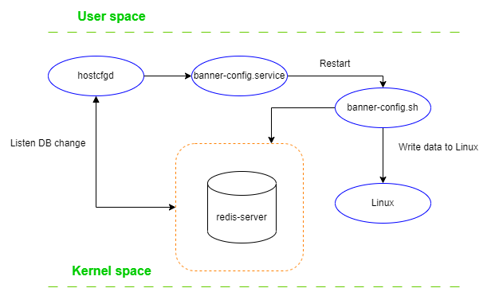
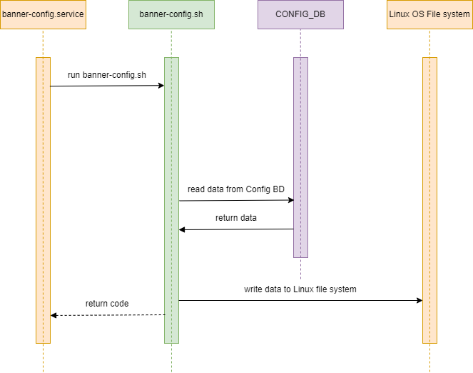
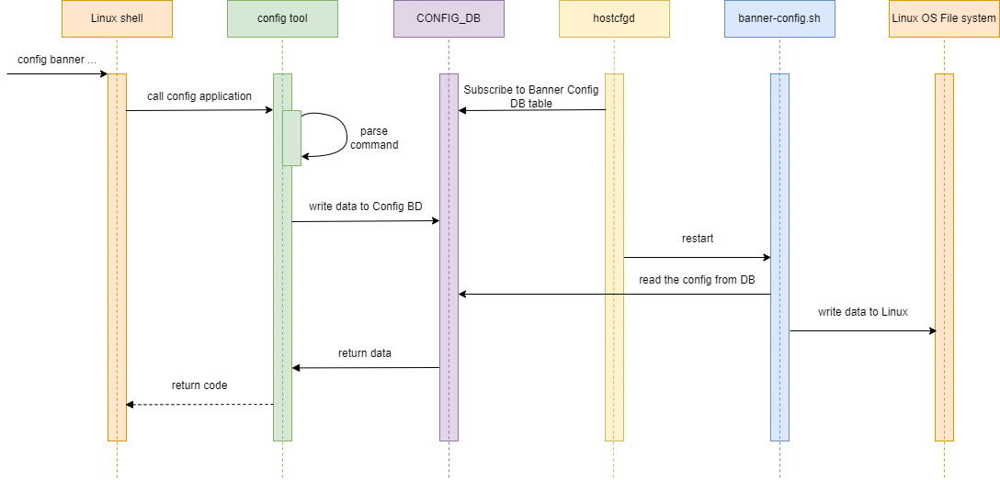
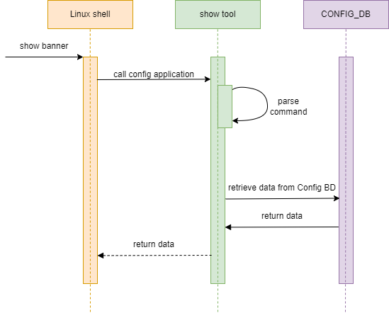

# Banner messages HLD #

## Table of contents
- [Revision](#revision)
- [About this manual](#about-this-manual)
- [Scope](#scope)
- [1 Introduction](#1-introduction)
  - [1.1 Feature overview](#11-feature-overview)
  - [1.2 Requirements](#12-requirements)
- [2 Design](#2-design)
  - [2.1 Overview](#21-overview)
  - [2.2 Flows](#25-flows)
  - [2.3 CLI](#26-cli)
      - [2.3.1 Config command group](#231-config-command-group)
      - [2.3.2 Show command](#232-show-command)
  - [2.4 YANG model](#24-yang-model)
- [3 Test plan](#3-test-plan)
  - [3.1 Unit tests via VS](#31-unit-tests-via-vs)


# Revision
| Rev | Date       | Author              | Description     |
|:---:|:----------:|:-------------------:|:----------------|
| 0.1 | 01/02/2023 | Sviatoslav Boichuk  | Initial version |


# About this manual
This document provides a high-level information for the SONiC Banner feature and Banner CLI. It describes high-level behavior, internal definition, design of the commands, syntax, and output definition.

# Scope
The scope of this document is to cover definition, design and implementation of SONiC Banner feature and Banner CLI.
The document covers the next CLI:
1.	Commands to configure banner messages
2.	Command to display banner settings

<!-- omit in toc -->
## Abbreviations
| Term  | Meaning                                   |
|:------|:------------------------------------------|
| SONiC | Software for Open Networking in the Cloud |
| MOTD  | Message of the day                        |
| DB    | Database                                  |
| CLI   | Сommand-line Interface                    |
| YANG  | Yet Another Next Generation               |

<!-- omit in toc -->
## List of figures
- [Figure 1: Banner system chart diagram](#figure-1-banner-system-chart-diagram)
- [Figure 2: Banner init flow](#figure-2-banner-init-flow)
- [Figure 3: Banner config flow](#figure-3-banner-config-flow)
- [Figure 4: Banner show configuration](#figure-4-banner-show-configuration)

# 1 Introduction

## 1.1 Feature overview
The SONiC maintains several messages for communication with users. These messages are associated with login and logout processes.

There are few banners message types:
|  Type         |  Description                                                                    |
| :-----------: | :-----------------------------------------------------------------------------: |
|  login        | Display a banner to the users connected locally or remotely before login prompt |
|  motd         | Display a banner to the users after login prompt                                |
|  logout       | Display a logout banner to the users connected locally or remotely              |


## 1.2 Requirements

**This feature will support the following functionality:**
1. Show Banner configuration
2. Configure Banner
    1. Login message
    2. Logout message
    3. MOTD

# 2 Design

## 2.1 Overview
Here is the representation of SONiC platform using Banner feature:


<!-- omit in toc -->
###### Figure 1: Banner system chart diagram

This feature require access to SONiC DB. All messages (MOTD, login and logout) saved into the SONiC config database. Hostcfgd will listen for the configuration changes in corresponding tables and restart banner-config service. Banner config service - it is simple SystemD service which runs before we get SSH connection. It reads configured messages from database and apply it to Linux.

## 2.2 Flows
<!-- omit in toc -->
### 2.2.1 Banner init flow

<!-- omit in toc -->
###### Figure 2: Banner init flow

<!-- omit in toc -->
### 2.5.2 Banner config flow

<!-- omit in toc -->
###### Figure 3: Banner config flow

<!-- omit in toc -->
### 2.5.2 NTP show configuration

<!-- omit in toc -->
###### Figure 4: Banner show configuration


## 2.3 CLI

<!-- omit in toc -->
### 2.3.1 Command structure

**User interface**:
```
config
\-- banner
    |-- login <message>
    |-- logout <message>
    |-- motd <message>

show
\-- banner
```

**Options:**

General:
1. `<message>` - Message to be configured: `string`

#### 2.3.1 Config command group
**The following command set loin banner message:**
```bash
config banner login <message>
```

**The following command set logout banner message:**
```bash
config banner logout <message>
```

**The following command set mesage of the day (MOTD):**
```bash
config banner motd <message>
```

#### 2.3.2 Show command
**The following command display banner configuration:**
```bash
root@sonic:/home/admin# show banner

Banners:
  Message of the Day (MOTD):
    SONiC Switch

  Login:
    SONiC Switch Management

  Logout:
    Goodbye
```

## 2.4 YANG model
New YANG model `sonic-banner.yang` will be added to provide support for configuring Banner messages.

**Skeleton code:**
```
 module sonic-banner {

    yang-version 1.1;

    namespace "http://github.com/sonic-net/sonic-banner";
    prefix banner_message;

    description "BANNER_MESSAGE YANG Module for SONiC-based OS";

    revision 2023-05-18 {
        description "First Revision";
    }

    container sonic-banner {

        container BANNER_MESSAGE {

            description "BANNER_MESSAGE part of config_db.json";

            container pre_login {

                leaf message {
                    type string;
                }

            }

            container post_login {

                leaf message {
                    type string;
                }

            }

            container post_logout {

                leaf message {
                    type string;
                }

            }

        }
        /* end of container BANNER_MESSAGE */
    }
    /* end of top level container */
}
/* end of module sonic-banner */
```

# 3 Test plan

## 3.1 Unit tests

1. Configure login banner message
    1. Logout form system. Login again - expected to see configured message
    before login prompt.
    2. Do not save configuration and reboot device -  expected to see default message before login prompt.
    3. Save configuration and reboot device -  expected to see configured message before login prompt.
2. Configure message of the day
    1. Logout form system. Login again - expected to see configured message
    after login prompt.
    2. Do not save configuration and reboot device -  expected to see default message after login prompt.
    3. Save configuration and reboot device -  expected to see configured message after login prompt.
3. Configure logout banner message
    1. Logout form system - expected to see configured logout message.
    2. Do not save configuration and reboot device. Logout from system after reboot - expected to see default message before login prompt.
    3. Save configuration and reboot device. Logout from system after reboot expected to see configured message before login prompt.